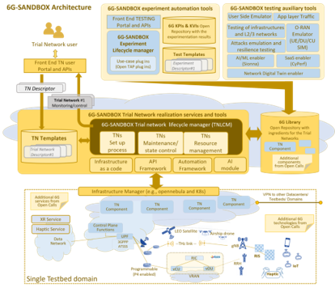

The 6G-SANDBOX project main goal is to develop a comprehensive and modular testbed infrastructure to support the experimentation and validation of emerging 6G technologies and advancements in 5G-Advanced.

From a technical perspective, the testbed should be supported by a physical infrastructure that conforms a micro data center with cloud capabilities such as elasticity, resilience, and ease of management.

The reference architecture of this micro data center is a fundamental piece and one of the enablers of the 6G-SANDBOX project.

    

