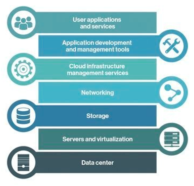
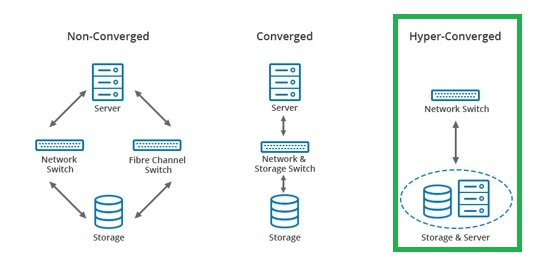
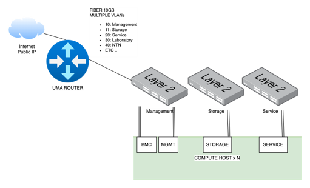
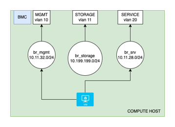
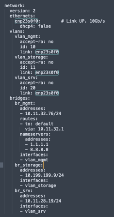
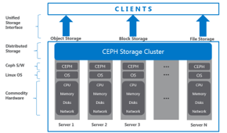
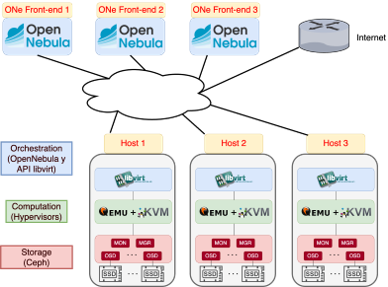
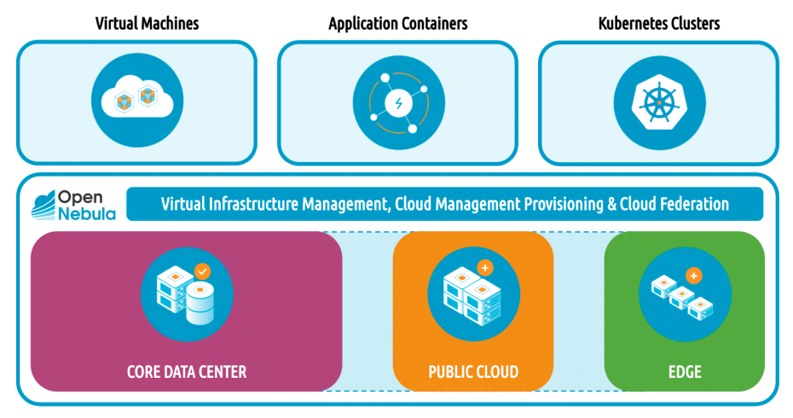
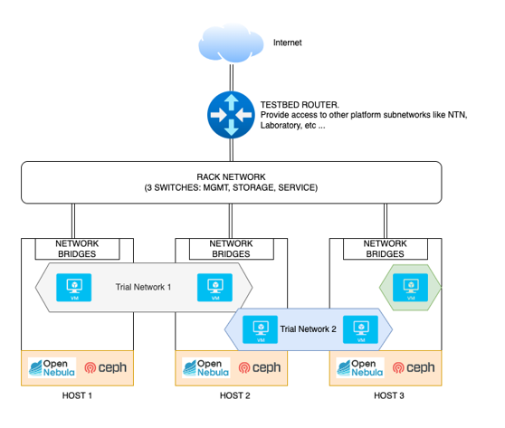

## Installation requirements

The main goal of the 6G-SANDBOX project is to develop a comprehensive and modular testbed to support the experimentation and validation of advancements in 5G-Advanced and emerging 6G technologies. From a technical perspective, the testbed must be supported by a physical infrastructure that conforms to a micro data center and incorporates the various layers of the Cloud Computing Stack depicted in Figure 3. This stack shall provide comprehensive end-to-end functionality with cloud capabilities like elasticity, resilience, and ease of management. For each one of the layers in the stack, the following sections outline the minimum requirements necessary to build an effective trial network (we use as an example the deployments conducted in the UMA site).

## Layers

The cloud computing stack used in 6G-SANDBOX is:

### Datacenter

A Hyper-Converged Infrastructure (HCI) data center (Figure 4) is a modern computing infrastructure that integrates computer, storage, and networking components into a single system to streamline deployment and management. Unlike traditional data centers, HCI leverages software-defined technology to create a more scalable, flexible, and manageable environment. It consolidates these resources into a unified system that can be easily controlled through a centralized software platform, enabling enhanced efficiency, reduced complexity, and improved performance. HCI data centers are designed to support cloud-like capabilities, such as elasticity and resilience, making them ideal for a wide range of enterprise applications and workloads.

### Networking

- One public IP to allow experimenters access to Trial Networks via VPN
- One fiber (10GB) from UMA router to the top of the rack switch. All traffic is encapsulated on different VLAN
- At least 3 networks:
  - Management and BMC: O&M (1G) 
  - Service: to Publish services (10G shared) 
  - Storage: internal between hosts to enable shared storage (10G dedicated)(Optional but recommended) 
- Compute hosts interfaces:
  - BMC: web console to remote host management
  - MGMT: operations & Management Interface
  - Storage: dedicated interface only for storage. Optional, but needed if you want to use shared storage between computed nodes
  - Service: publish services, internet access, etc.
- At least one network should be shared between all the hosts. It can be done with:
  - Traditional VLAN, extending between all the hosts, switches, etc.
  - VXLAN, creating an overlay network
  - Be careful with MTU on both cases

- Multiple virtual interfaces, one per VLAN
- Multiple bridges bound to one virtual interface VLAN
- Multiple virtual nets inside OpenNebula, each associated to a bridge
- When a virtual machine is created, OpenNebula add a new virtual interface to the appropriate bridge

### Storage

SDS: Software define Storage

- [Ceph](https://github.com/OpenNebula/one-deploy/wiki/arch_single_ceph) for a shared pool of block storage between all hosts of the Data Center
- Each host dedicates 0, 1 or more drives to the storage pool. One Daemon “OSD” per drive for its management
- Data has x3 replication. Writes and reads are made directly to the OSD with the desired information
- Efficient resource utilization, and almost infinite flexibility
- De Facto Standard for shared storage in many platforms like Proxmox, OpenStack and OpenNebula

### Compute hosts

- At least 3 x86-64 hosts to warranty high availability
- OpenNebula needs 3 or more Front-end, for High Availability. Front-end instances can be separate hosts or Virtual Machines inside the hypervisor hosts
- Host resources should be enough to:
  - Back the Ceph shared storage services
  - Host the OpenNebula Front-end VMs
  - Have spare memory and CPUs to deploy and virtualize new instances 

### Virtualization and cloud

[OpenNebula](https://github.com/OpenNebula/) is an open-source solution for building and managing private clouds.

Advantages:

- VMs, Containers, and K8s clusters
- Hybrid: private, public or edge nodes
- Unify the management of all your resources
- Supports any base hardware
- Multitenant and federation

### Application, SaaS

The SaaS is a platform that is being developed within 6G Sandbox Project.

## Summary

The recommendations are:

- At least 3 hosts with enough resources according to the size of the testbed
- At least 3 networks
  - Service network should be extended between hosts to allow 6G-Sandbox Trial Networks deployment
  - Storage network must be extended to all hosts if shared storage is in use
- OpenNebula as Virtualization and Cloud Manager
- CEPH as SDS that now can be installed along OpenNebula
- Use of VLANs and bridges for the testbed networking configuration, and VXLAN for overlay networks that will be used in the trial networks
- This architecture can be extended with many hosts up to a medium size datacenter

