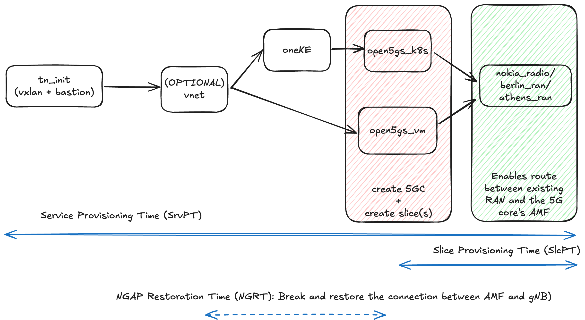

What we want to achieve in the page is to measure and benchmark the time it takes to deploy a Trial Netowrk involving a physical gNB and a virtual 5G Core in different sites.

The target values to measure are:
- **SrvPT** or *Service Provisioning Time*: Time taken to provision the entire Trial Network, including RAN and 5GC components.
- **SlcPT** or *Slice Provisioning Time*: Time taken since the slice is created in the 5GC, and a connection to the gNB is established.
- **NGRT** or *NGAP Restoration Time*: Time taken to restore the NGAP connection between gNB and 5GC after a disruption (e.g., restarting the 5GC or network issues).

## Results

### Site UMA

The experiments were conducted at the UMA site using component `open5gs_k8s` over `oneKE` with a private `vnet`, and component `nokia_radio`.

(DESCRIPTOR FILE USED - PLEGATED)
(TABLE WITH RESULTS)
