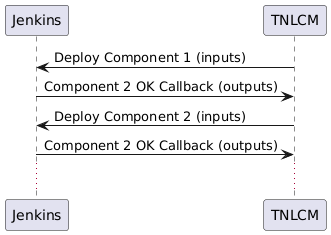

import Link from "@docusaurus/Link";
import { LIBRARY_GLOBAL_PAC_TN_DEPLOY, LIBRARY_GLOBAL_CAC_LOAD_VARIABLES, SITES_REPO_URL } from "@site/src/constants/v0.5.1";

The 6G-Library repository the includes all the necessary code and data to deploy and configure each component of a Trial Network. Each component's metadata and code are used by both the TNLCM and the Jenkins of a Site.

Every directory represents an available component in the 6G Sandbox project, except the `.global/`, which includes general information to all components such as:
- `cac/`: Ansible task files importable from any component
- `iac/`: Terraform provider and backend files.
- `json_templates/`: JSON templates to perform a callback to the TNLCM after each deployment
- `pac/`: The Jenkinsfiles defining the pipelines available from the Jenkins

## How a component is deployed

Prior to the development of a component, is crucial to understand how the basic workflow of a Trial Network deployment works:

<div style={{ textAlign: "center" }}>
  
</div>

### TNCLM sends request to Jenkins

When a TN descriptor is registered in the TNLCM, it begins making a succession of requests to the Jenkins, to start the deployment of each component one at a time.
Each request contains the parameters required by the <Link to={LIBRARY_GLOBAL_PAC_TN_DEPLOY}>TN_DEPLOY</Link> pipeline, including the corresponding input file. This file includes the input variables listed in the TNLCM's TN descriptor. You can find an example of a usable input file for each component in this repo as `{component_type}/sample_input_file.yaml`.

Most inputs just serve to overwrite a private value, but others (mainly mandatory ones) serve to define dependencies between componentes.
The available inputs for each component are described at `{component_type}/.tnlcm/public.yaml`

### Jenkins starts the corresponding Ansible playbook

The TN_DEPLOY pipeline first writes its parameters and the component's inputs as variable files loadable by Ansible, then clones the <Link to={SITES_REPO_URL}>6G-Sandbox-Sites</Link> repository and finally launches the playbook `{COMPONENT_TYPE}/code/component_playbook.yaml`.

### Ansible playbook

Ansible executes the playbook `{component_type}/code/component_playbook.yaml` which will load the necessary inputs, deploy the component (using terraform or Helm Charts), and generate a list of outputs.

A Trial Network uses terraform as a way to achieve Infrastructure as Code (IaC), and as such, component's manifests along with the .tfstate file are uploaded to the chosen S3 storage backend (currently only MinIO).

The steps on how to structure a `component_playbook.yaml` are described in the [Playbook Development Guide](./playbook-deployment-guide.mdx).

### TNLCM callback

As the last step of the Ansible playbook, a final callback to the TNLCM is sent using the format of the files in `.global/json_templates/` with the execution result and the generated outputs.

The outputs expected by the TNLCM are described at `{component_type}/.tnlcm/public.yaml`

## Extra

Expanding step 3 and prior to the [Playbook Development Guide](./playbook-deployment-guide.mdx), it must be noted that there are multiple sources of variables available for a playbook.

The first and most important one is the <Link to={LIBRARY_GLOBAL_CAC_LOAD_VARIABLES}>`.global/cac/load_variables.yaml`</Link> task file, which loads the following variable files in order, overwriting the previous ones:
- **`6G-Sandbox-Sites/{{ deployment_site }}/core.yaml"`**: Variables unique to each site loaded from repository <Link to={SITES_REPO_URL}>6G-Sandbox-Sites</Link>
- **`{{ component_type }}/variables/{{ site_hypervisor }}/private.yaml`**: Default variables unique to each component.
- **`{{ component_type }}/variables/input_file.yaml`**: Component inputs. File created during the Jenkins pipeline. Most of them simply overwrite some of the private variables.
- **`{{ component_type }}/variables/pipeline_parameters.yaml`**: Jenkins parameters. File created during the Jenkins pipeline.

Environment variables aren't a reliable source of information, but some of them can also be used inside pipelines. Useful environment variables include the instanced Jenkins credentials (as seen in the environment field in <Link to={LIBRARY_GLOBAL_PAC_TN_DEPLOY}>TN_DEPLOY</Link>). The WORKSPACE does not need to be referenced as an environmental variable, as is passed as an argument when the playbook is launched.

However, to address the problem of variable dependencies between components, we can use another source of variables: **terraform outputs**.
In the same way we generate a list of outputs for the TNLCM callback, we can also write them as as terraform outputs and apply them to be available from any deployment.

E.g. these are the outputs of an end2end demo as gathered by step `Retrieve terraform outputs` (command `terraform output --json | jq 'with_entries(.value |= .value)`)

```json
{
  "oneKE-k8s-id": "247",
  "oneKE-k8s-node_ids": "{'vnf_0': '1534', 'master_0': '1535', 'worker_0': '1536', 'storage_0': '1537', 'storage_1': '1538', 'storage_2': '1539'}",
  "oneKE-k8s-node_ips": "{'vnf_0': '192.168.199.2', 'master_0': '10.10.10.2', 'worker_0': '10.10.10.3', 'storage_0': '10.10.10.4', 'storage_1': '10.10.10.5', 'storage_2': '10.10.10.6'}",
  "oneKE-k8s-roles": [
    {
      "cardinality": 1,
      "name": "vnf",
      "nodes": [
        1534
      ],
      "state": 2
    },
    {
      "cardinality": 1,
      "name": "master",
      "nodes": [
        1535
      ],
      "state": 2
    },
    {
      "cardinality": 1,
      "name": "worker",
      "nodes": [
        1536
      ],
      "state": 2
    },
    {
      "cardinality": 3,
      "name": "storage",
      "nodes": [
        1537,
        1538,
        1539
      ],
      "state": 2
    }
  ],
  "open5gs-core-metadata": "{'oneKE': 'oneKE-k8s', 'proxy': '192.168.199.2', 'mcc': '001', 'mnc': '01', 'msin': '0000000001', 'key': '465B5CE8B199B49FAA5F0A2EE238A6BC', 'opc': 'E8ED289DEBA952E4283B54E88E6183CA', 'apn': 'internet', 'tac': '200', 's_nssai_sst': '1', 's_nssai_sd': '1', 'amf_ip': '10.10.10.200', 'upf_ip': '10.10.10.200'}",
  "tn_bastion-id": "1533",
  "tn_bastion-ips": {
    "0": "10.11.28.148",
    "489": "192.168.199.1"
  },
  "tn_ssh_public_key": "ssh-ed25519 AAAAC3NzaC1lZDI1NTE5AAAAII8QSQdOy3LAS7EG1F19eiOtjGVO6+I7NY+94JrMfIaw tnuser@e2enueva",
  "tn_vxlan-id": "489",
  "ueransim-gnb-gnb_metadata": "{'proxy': '192.168.199.2', 'amf_address': '10.10.10.200', 'mcc': '001', 'mnc': '01', 'msin': '0000000001', 'key': '465B5CE8B199B49FAA5F0A2EE238A6BC', 'opc': 'E8ED289DEBA952E4283B54E88E6183CA', 'apn': 'internet', 'tac': '200', 'sst': '1', 'sd': '1', 'gnb_address': '192.168.199.3'}",
  "ueransim-gnb-id": "1540",
  "ueransim-gnb-ips": {
    "489": "192.168.199.3"
  },
  "ueransim-gnb-run_gnb": "YES",
  "ueransim-ue-id": "1541",
  "ueransim-ue-ips": {
    "489": "192.168.199.4"
  },
  "ueransim-ue-run_ue": "YES",
  "ueransim-ue-ue_metadata": "{'supi': 'imsi-001010000000001', 'mcc': '001', 'mnc': '01', 'key': '465B5CE8B199B49FAA5F0A2EE238A6BC', 'opc': 'E8ED289DEBA952E4283B54E88E6183CA', 'gnbSearchList': '192.168.199.3', 'apn': 'internet', 'sst': '1', 'sd': '1'}",
  "vnet-private_oneKE-id": "490"
}
```

:::note
outputs syntax is `<component_name>[-custom_name]-<output_name>`. Some of them are generated in the terraform apply steps, others are defined explicitly in file `tf-custom_outputs.tf`. oneKE-k8s-roles is obviously generated by terraform apply, its useful information is compiled into outputs oneKE-k8s-node_ids and oneKE-k8s-node_ips.
:::
