import Link from "@docusaurus/Link";
import { LIBRARY_REPO_URL } from "@site/src/constants/v0.5.1";

# Swagger UI

## Login

The API set forth in the TNLCM is as follows:

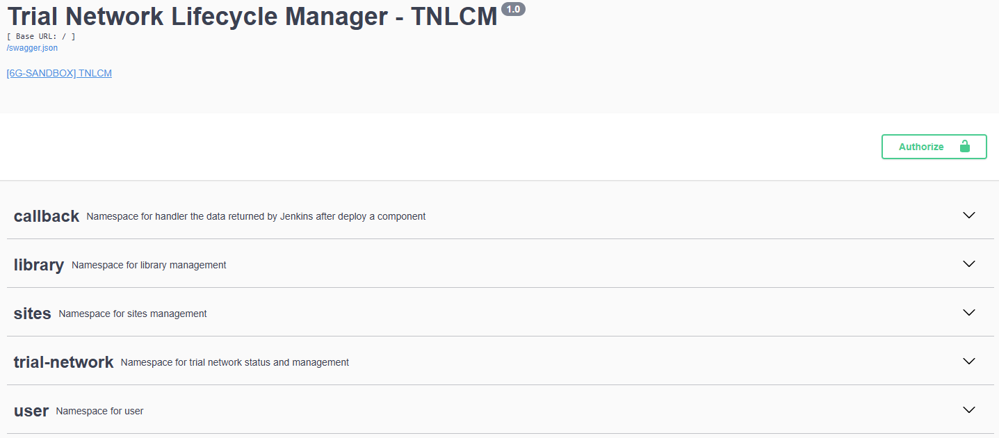

If it is the first time using the API it is necessary to create a user:

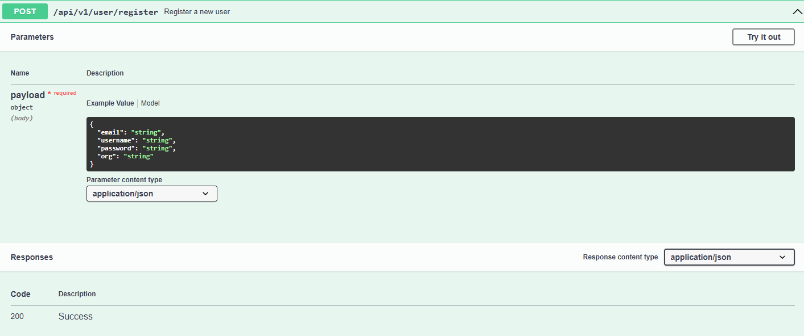

Once the user has been created or if it has been previously created, add the user and its password in the Basic Authorization section of the **Authorize** box:

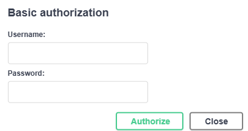

Once the user has been added, an access token and its refresh token can be generated. This access token has a duration of one day (can be modified):

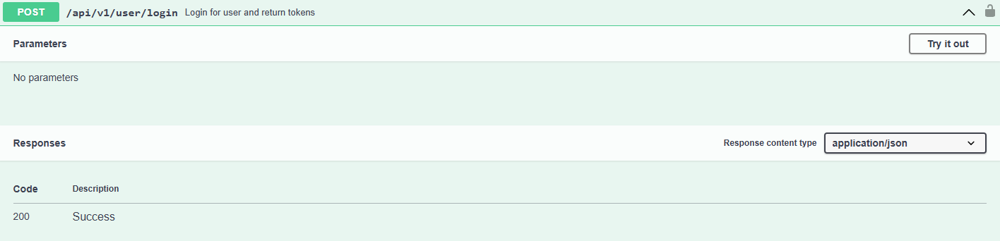

The next step is to add the token in the green **Authorize** box. It is required to put the word **Bearer**, a space and then the token. An example is shown:

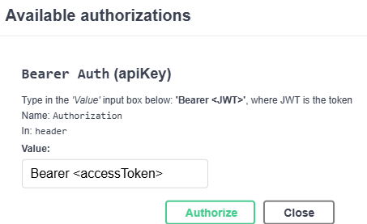

Now, requests that involve having an access token can be made.

If the access token expires, it can be refreshed by using the refresh token. The token in the green **Authorize** box must be updated with the refresh token and the post request must be made:

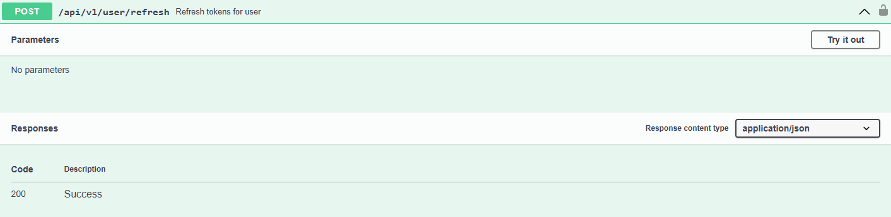

When the request is made, it will return another access token that will need to be put back into the green **Authorize** box.


## Create a Trial Network inside TNLCM

Once logged into TNLCM, execute the POST request of the `trial-network` namespace:

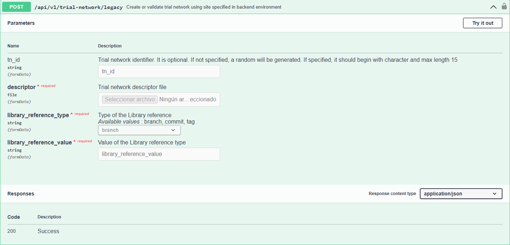

Fill in the following fields:

- `tn_id`: must start with a character and be at least 4 characters long. This field can be left blank, in which case a random value will be generated.
- `descriptor`: descriptor file containing the definition of the trial network. To create a descriptor file, refer to the [Trial Network Descriptor Schema](./descriptor.mdx) section.
- `library_reference_type`: you can specify a branch, tag, or commit of the <Link to={LIBRARY_REPO_URL}>6G-Library</Link> repository.
- `library_reference_value`: value corresponding to the type specified in the `library_reference_type` field.

### Response

- **HTTP Code:** `200 OK`
- **Content-Type:** `application/json`
- **Description:** A successful request returns information about the validated trial network.

Example response:

```json
{
  "user_created": "example_user",
  "tn_id": "example_tn_name",
  "state": "validated",
  "date_created_utc": "2025-05-20T14:39:43.466983+00:00",
  "deployment_site": "6g-sandbox-site",
  "directory_path": "/opt/TNLCM_BACKEND/core/trial_networks/example_user",
  "library_https_url": "https://github.com/6G-SANDBOX/6G-Library.git",
  "library_commit_id": "a3c5f6d7b8e9c2a1f0d4e3b2a9c8e7f6d5b4c3a2",
  "sites_https_url": "https://github.com/6G-SANDBOX/6G-Sandbox-Sites.git",
  "sites_commit_id": "f7e6d5c4b3a2f1e0d9c8b7a6e5d4c3b2a1f0e9d8"
}
```

## Deploy a Trial Network to your site

Once logged into TNLCM and the trial network has been created, execute the PUT request of the `trial-network` namespace, to start the deployment of the Trial Network.
This will trigger serveral Jenkins pipelines secuentally, one per component in your descriptor.

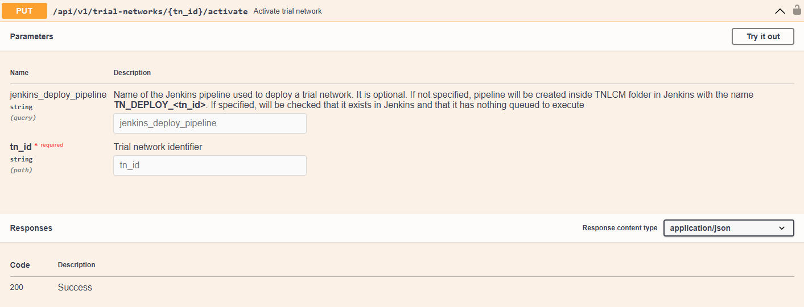

Fill in the following fields:

- `jenkins_deploy_pipeline`: if nothing is specified, a pipeline will be created inside the TNLCM folder in Jenkins with the name `TN_DEPLOY_<tn_id>`. If specified, it will be checked if it exists in Jenkins and that there is nothing queued to execute.
- `tn_id`: the identifier of the trial network received in the [POST request](#create-trial-network).

### Response

- **HTTP Code:** `200 OK`
- **Content-Type:** `application/json`
- **Description:** A successful request returns a message informing that the trial network with identifier `example_tn_name` has been activated.

## Retrieve all trial networks

You can retrieve the list of all available trial networks by executing the GET request to the trial-networks namespace:

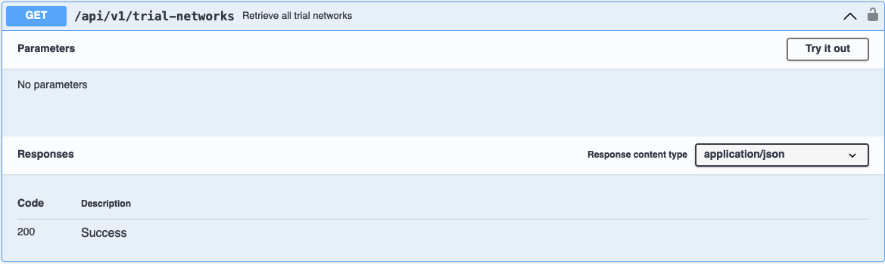

This request does not require any parameters.

### Response

- **HTTP Code:** `200 OK`
- **Content-Type:** `application/json`
- **Description:** A successful response returns a list of all trial networks currently available.

## Retrieve trial network by ID

You can retrieve detailed information about a specific trial network by executing the GET request to the trial-networks namespace with the trial network identifier:

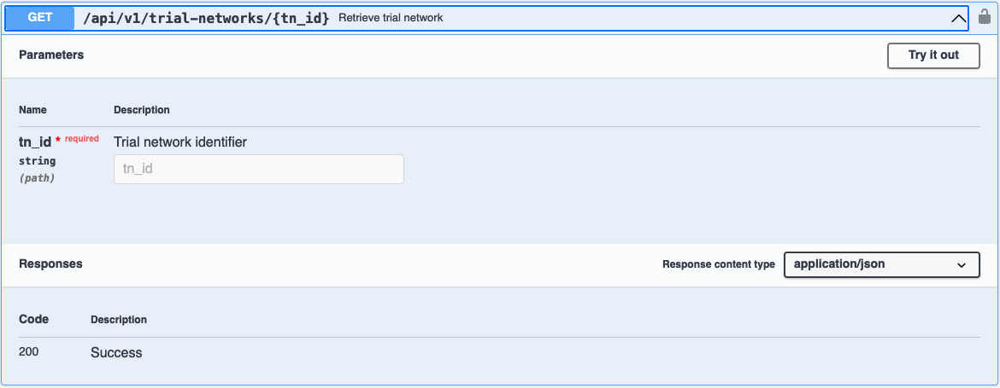

Fill in the following field:

- `tn_id`: identifier of the trial network to be retrieved.

### Response

- **HTTP Code:** `200 OK`
- **Content-Type:** `application/json`
- **Description:** A successful response returns the detailed information of the specified trial network.

## Retrieve trial network log content

You can retrieve the content of the log file for a specific trial network by executing the GET request to the trial-networks namespace:

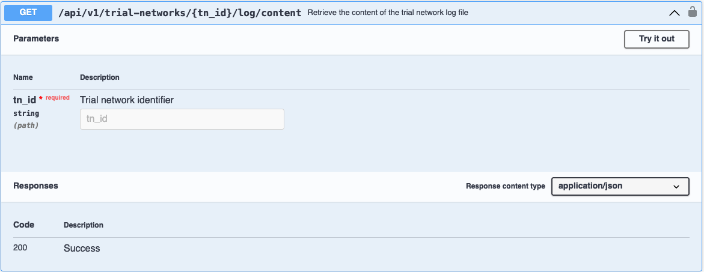

Fill in the following field:

- `tn_id`: identifier of the trial network whose log content you want to retrieve.

### Response

- **HTTP Code:** `200 OK`
- **Content-Type:** `application/json`
- **Description:** A successful response returns the full content of the log file associated with the specified trial network.

## Download trial network log file

You can download the log file for a specific trial network by executing the GET request to the trial-networks namespace:

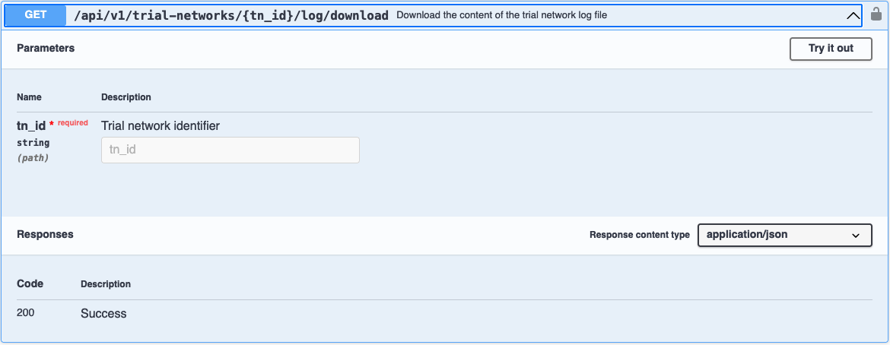

Fill in the following field:

- `tn_id`: identifier of the trial network whose log file you want to download.

### Response

- **HTTP Code:** `200 OK`
- **Content-Type:** `application/json`
- **Description:** A successful request triggers the download of the log file associated with the specified trial network.

The downloaded file will be named as `tn_name.log`, where `tn_name` corresponds to the name (identifier) of the trial network.

## Retrieve trial network report content

You can retrieve the content of the report file for a specific trial network by executing the GET request to the trial-networks namespace:

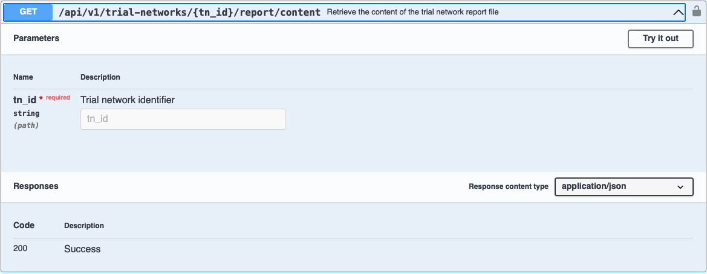

Fill in the following field:

- `tn_id`: identifier of the trial network whose report content you want to retrieve.

### Response

- **HTTP Code:** `200 OK`
- **Content-Type:** `application/json`
- **Description:** A successful response returns a JSON object with a `report_content` field.

The `report_content` contains a full Markdown-formatted deployment report. This includes technical and operational details such as:

- **Network configuration**
  - OpenNebula VNet IDs
  - VXLAN subnet and addressing
  - MTU values

- **Bastion node configuration**
  - OpenNebula VM ID
  - Network interfaces
  - SSH keypair (public and private keys)
  - VPN configuration (Wireguard)

- **Access credentials and links**
  - DNS server admin credentials
  - Technitium DNS access URL

- **Component specifications**
  - Specifications for the deployed components.
  - Network interfaces for the components.

> ⚠️ Some sections include sensitive data such as SSH private keys and VPN credentials. Handle with care.

## Download trial network report file

You can download the Markdown report file generated after the deployment of a specific trial network by executing the GET request to the trial-networks namespace:

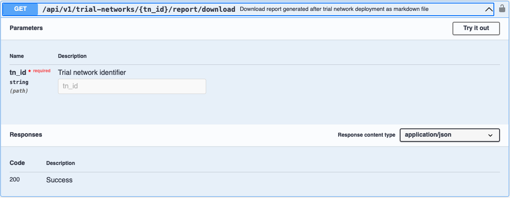

Fill in the following field:

- `tn_id`: identifier of the trial network whose report you want to download.

### Response

- **HTTP Code:** `200 OK`
- **Content-Type:** `application/json`
- **Description:** A successful request triggers the download of a Markdown (`.md`) file containing the deployment report for the specified trial network.

The file is typically named `tn_name.md`, where `tn_name` corresponds to the name (identifier) of the trial network.

> 📄 The content is the same as retrieved via [`/report/content`](#retrieve-trial-network-report-content), but saved as a downloadable Markdown file for offline storage or sharing.

## Destroy trial network

Once logged into TNLCM, the trial network has been created and the trial network has been deployed, execute the DELETE request to destroy a trial network:

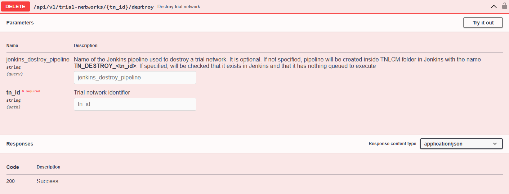

Fill in the following fields:

- `jenkins_destroy_pipeline`: if nothing is specified, a pipeline will be created inside TNLCM folder in Jenkins with the name `TN_DESTROY_<tn_id>`. If specified, it will be checked if it exists in Jenkins and that there is nothing queued to execute.
- `tn_id`: the identifier of the trial network received in the [POST request](#create-trial-network).

### Response

- **HTTP Code:** `200 OK`
- **Content-Type:** `application/json`
- **Description:** A successful request returns a message informing that the trial network with identifier `example_tn_name` has been destroyed.

## Purge trial network

Once logged into TNLCM, the trial network has been created, deployed and destroyed, execute the DELETE request to purge a trial network:

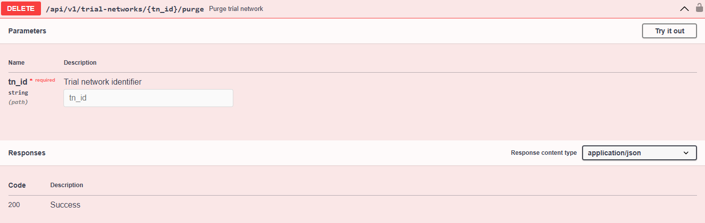

Fill in the following fields:

- `tn_id`: the identifier of the trial network received in the [POST request](#create-trial-network).

### Response

- **HTTP Code:** `200 OK`
- **Content-Type:** `application/json`
- **Description:** A successful request returns a message informing that the trial network with identifier `example_tn_name` has been purged and in this state, the trial network has been deleted and cannot be recovered.
