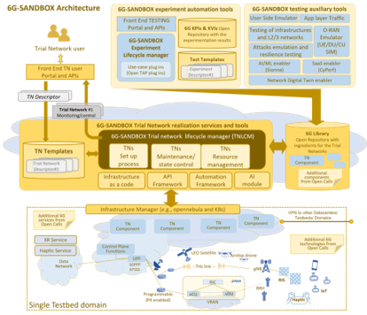
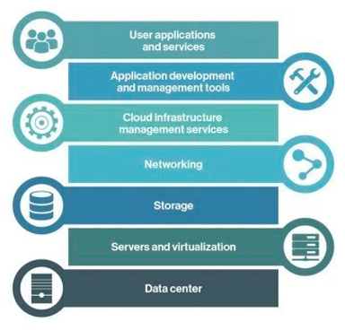
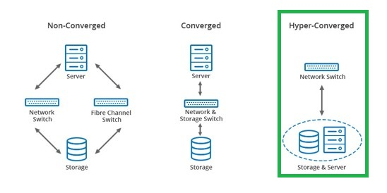
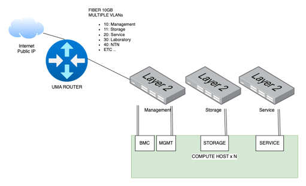
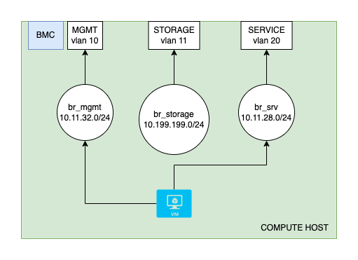
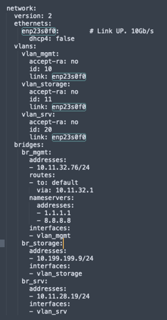
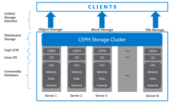
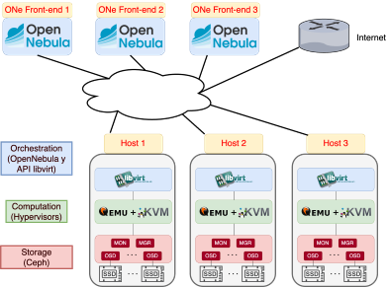
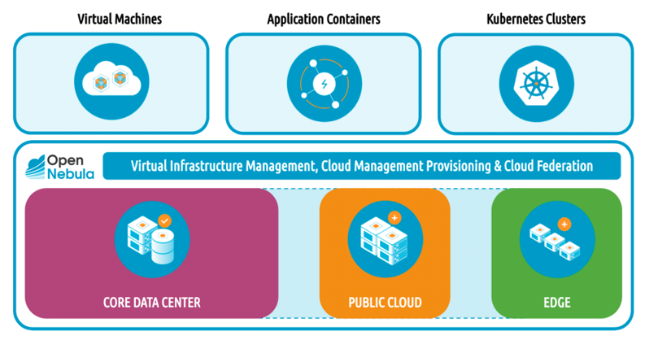
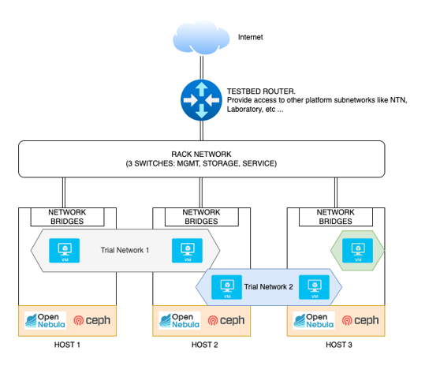

import Link from "@docusaurus/Link";
import { OPENNEBULA_REPO_ORG, ONE_DEPLOY_WIKI_ARCH_SINGLE_CEPH } from "@site/src/config/constants";

The 6G-SANDBOX project main goal is to develop a comprehensive and modular testbed infrastructure to support the experimentation and validation of emerging 6G technologies and advancements in 5G-Advanced.

From a technical perspective, the testbed should be supported by a physical infrastructure that conforms a micro data center with cloud capabilities such as elasticity, resilience and ease of management.

While originally multiple virtualization platforms were considered to be supported simultaneously for the 6G-SANDBOX project, <Link to={OPENNEBULA_REPO_ORG}>OpenNebula</Link> was finally selected as the preferred solution for building and managing private clouds within the 6G-SANDBOX ecosystem. OpenNebula offers a robust and flexible platform that aligns well with the project's requirements for scalability, resource management, and ease of deployment.

The reference architecture of this micro data center is a fundamental piece and one of the enablers of the 6G-SANDBOX project.

<div style={{ textAlign: "center" }}>

  
</div>

## 6G-SANDBOX site requirements

A 6G-Sandbox Site is made up of the following elements:
- An OpenNebula environment up and running, with enough spare resources to host the Trial networks and Services. Before deploying anythin Sandbox related, please ensure and validate that your environment is working: try to deploy VMs, create VXLAN vnets, and check that you can deploy [OpenNebula Services](https://docs.opennebula.io/7.0/product/virtual_machines_operation/multi-vm_workflows/overview/) (enable OneGate and OneFlow).
- A public IP and a range of valid availabple ports. They will be port-forwarded to the IPs that OpenNebula asign to the Trial networks bastions. [More information](https://github.com/6G-SANDBOX/6G-Sandbox-Sites/blob/main/.dummy_site/core.yaml).
- The [6G-SANDBOX Toolkit](../site_admin/toolkit.mdx) installed and running properly.
- A branch in the [6G-SANDBOX-Sites repository](https://github.com/6G-SANDBOX/6G-Sandbox-Sites) with the site information.

Each site's branch will have the following structure:

```
<site_name>/       # Directory with the site name
└── core.yaml    # File containing the encrypted site information
```

### General infrastructure recommendations

The main goal of the 6G-SANDBOX project is to develop a comprehensive and modular testbed to support the experimentation and validation of advancements in 5G-Advanced and emerging 6G technologies.
From a technical perspective, the testbed must be backed by a physical infrastructure that conforms to a micro data center and incorporates the various layers of the Cloud Computing Stack depicted in Figure 3
This stack shall provide comprehensive end-to-end functionality with cloud capabilities like elasticity, resilience and ease of management.
For each one of the layers in the stack, the following sections outline some general recommendations on how to build an effective 6G-Sandbox site infrastructure.

## Layers

The cloud computing stack used in 6G-SANDBOX is:

<div style={{ textAlign: "center" }}>

  
</div>

### Datacenter

A Hyper-Converged Infrastructure (HCI) data center (Figure 4) is a modern computing infrastructure that integrates computer, storage and networking components into a single system to streamline deployment and management. Unlike traditional data centers, HCI leverages software-defined technology to create a more scalable, flexible and manageable environment. It consolidates these resources into a unified system that can be easily controlled through a centralized software platform, enabling enhanced efficiency, reduced complexity and improved performance. HCI data centers are designed to support cloud-like capabilities, such as elasticity and resilience, making them ideal for a wide range of enterprise applications and workloads.

<div style={{ textAlign: "center" }}>

  
</div>

### Networking

A key part of the infrastructure setup is the networking configuration. The recommendations for the networking layer are:
- One available public IPv4 address to allow experimenters external access to Trial Networks via VPN.
- A redundant uplink connections with enough throughput to the internet. Recommended minimum 1 Gbps.
- 3 networks (VLANs) to ensure traffic seggregation according to their purpose. This is not mandatory but greatly improves performance and security:
  - Management and BMC: O&M (1Gbps) 
  - Service: where Services/VMs will send traffic (10Gbps) 
  - Storage: Private net between hosts to enable shared storage (10Gbps)

<div style={{ textAlign: "center" }}>

  
</div>

Each host will therefore need at least 3 physical interfaces, one per network.
To simplify its management, it is recommended to create vlan interfaces over each one of them (so that tagged 802.1Q is sent to the apropiate switch port), and a virtual bridge.
When a virtual machine is created, OpenNebula adds a new virtual interface to the appropriate bridge

<div style={{ textAlign: "center" }}>

  
</div>

<div style={{ textAlign: "center" }}>

  
</div>

### Storage
When installing OpenNebula, multiple datastore options will be available. While not mandatory, it is highly recommended to use a Shared Storage solution such as <Link to={ONE_DEPLOY_WIKI_ARCH_SINGLE_CEPH}>Ceph</Link> , so that workloads can be easily be migrated across nodes. 
- Each host can dedicate 0, 1 or more drives to the storage pool.
- Data will have x3 replication. Writes and reads in Ceph are made directly to the OSD with the desired information
- Efficient resource utilization and almost infinite flexibility
- Ceph is the de facto Standard for shared storage in many platforms like Proxmox, OpenStack and OpenNebula

<div style={{ textAlign: "center" }}>

  
</div>

### Compute hosts

- At least 3 x86-64 hosts to warranty high availability
- OpenNebula needs 3 or more Front-end, for High Availability. Front-end instances can be separate hosts or Virtual Machines inside the hypervisor hosts
- Host resources should be enough to:
  - Back the Ceph shared storage services
  - Host the OpenNebula Front-end VMs
  - Have spare memory and CPUs to deploy and virtualize new instances 

<div style={{ textAlign: "center" }}>

  
</div>

### Virtualization and cloud

<Link to={OPENNEBULA_REPO_ORG}>OpenNebula</Link> is an open-source solution for building and managing private clouds.

Advantages:
- VMs, Containers and K8s clusters
- Hybrid: private, public or edge nodes
- Unify the management of all your resources
- Supports any base hardware
- Multitenant and federation

<div style={{ textAlign: "center" }}>

  
</div>

## Summary

The recommendations are:
- At least 3 hosts with enough resources according to the size of the testbed
- At least 3 networks
  - Service network should be extended between hosts to allow 6G-Sandbox Trial Networks deployment
  - Storage network must be extended to all hosts if shared storage is in use
- OpenNebula as Virtualization and Cloud Manager
- CEPH as the shared storage solution, to be deployed in the same nodes as the OpenNebula hypervisors (HCI).
- Use of VLANs and bridges for the testbed networking configuration and VXLAN for overlay networks that will be used in the trial networks
- This architecture can be extended with many hosts up to a medium size datacenter.

<div style={{ textAlign: "center" }}>

  
</div>
