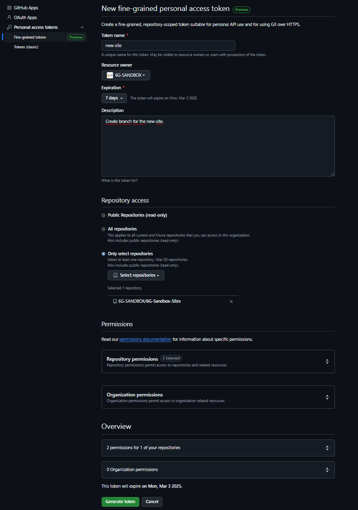
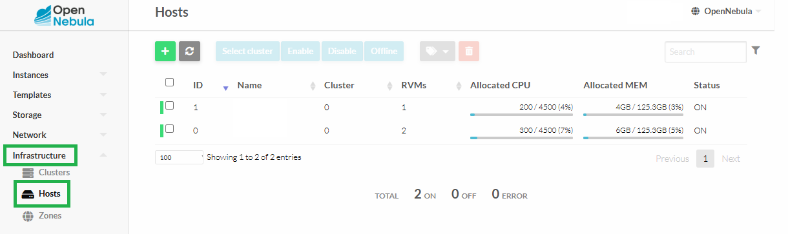
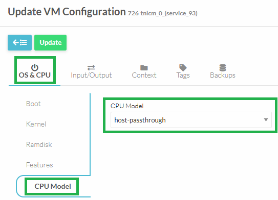
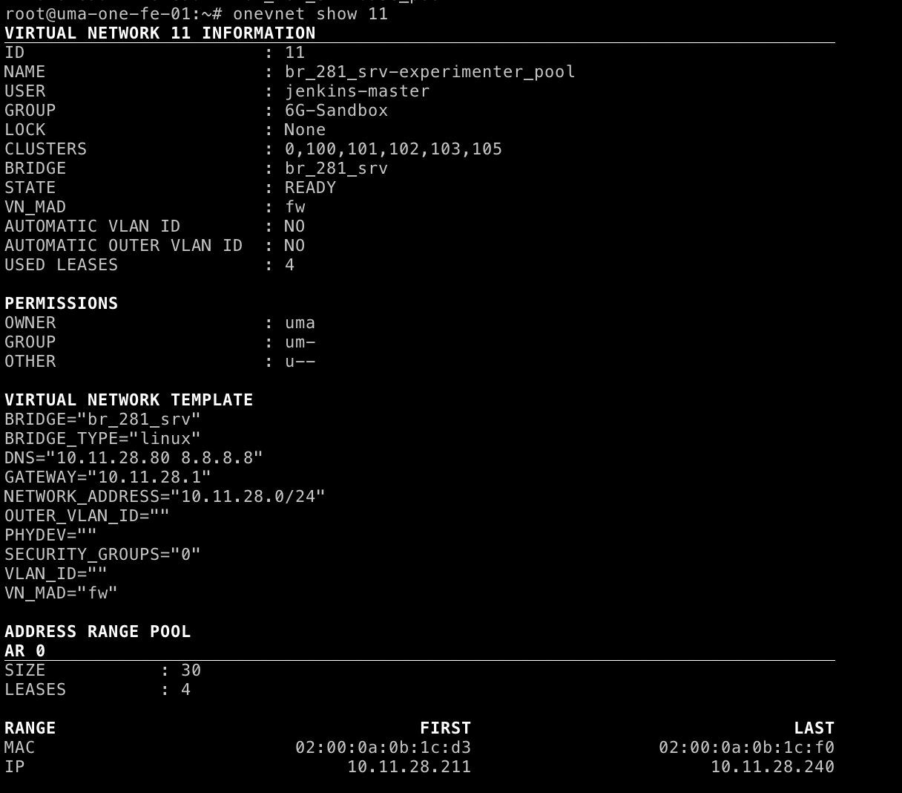
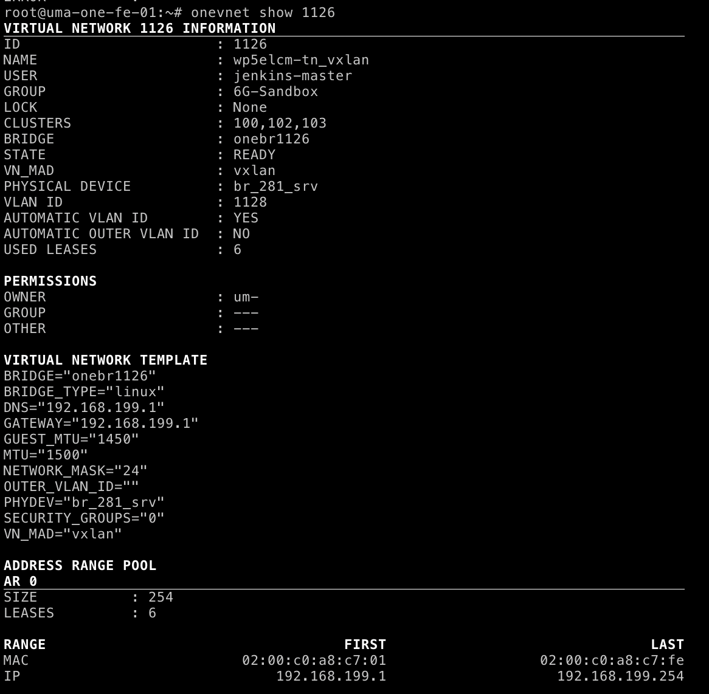
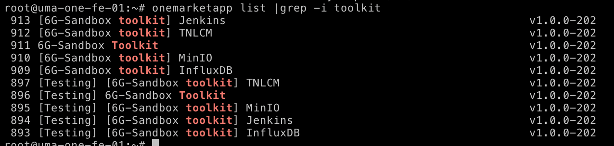
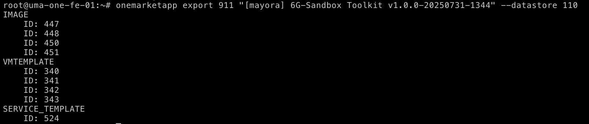
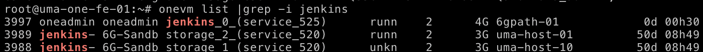
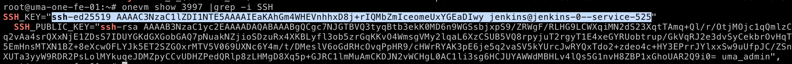

import CodeBlock from "@theme/CodeBlock";
import Link from "@docusaurus/Link";
import { SANDBOX_URL, MARKETPLACE_SERVICE_TOOLKIT, ONE_REPO_RELEASE, ONE_REPO_VERSION, SITES_ACCESS_REQUEST_ISSUE, SANDBOX_REPO_ORG, SANDBOX_REPO_TEAMS_SITES, TOOLKIT_INSTALLER_INSTALL_SCRIPT } from "@site/src/config/constants";

The Sandbox Toolkit consists of the necessary tools to create and manage 6G-SANDBOX Trial Networks within a 6G-SANDBOX [site](../site_admin/6g_sandbox_sites.mdx).
It involves the installation and configuration of 4 main VMs:
- **InfluxDB**: An open-source time series database designed for high-performance handling of time-stamped data, commonly used for monitoring, analytics, and IoT applications. Planed to be used to store experimentation results across multiple Trial Networks.
- **MinIO**: An open-source object storage system compatible with Amazon S3, designed for large-scale data infrastructure and supporting hybrid and cloud-native environments. Used to store all kind of files related to Trial Networks, such as Terraform manifests, SSH keys, autogenerated documentation, etc.
- **Jenkins**: An open-source automation server used to build, test, and deploy software projects, enabling continuous integration and delivery (CI/CD). Used as an Ansible controller, beggining all deployment pipelines.
- **TNLCM**: A tool for managing trial networks in the 6G-SANDBOX project, allowing users to create, deploy, and manage trial networks efficiently. Preprocesses Trial Network descriptors and interacts with Jenkins to automate deployments.

The 6G-Sandbox toolkit is implemented as an OpenNebula Service ([original](https://marketplace.mobilesandbox.cloud:9443/appliance/toolkit_service), [OpenNebula 7.0 fix](https://marketplace.mobilesandbox.cloud:9443/appliance/toolkit_service_7.0)), so that a single template can streamline the deployment of the multiple VMs in a parametrized way.


Additionally, there are other optional elements that can be present in a 6G-Sandbox site to provide additional functionalities. Examples are:
- [Technitium DNS](https://marketplace.mobilesandbox.cloud:9443/appliance/dns): Appliance with Technitium DNS server installed, which can be used to provide DNS services to the Trial Networks deployed in the site.
- [route-manager-api](https://marketplace.mobilesandbox.cloud:9443/appliance/routemanager): Appliance with the route-manager-api installed, a VM with a simple REST API to manage its static routes.


# Toolkit Installer

Toolkit installer is a Python script developed for the <Link to={SANDBOX_URL}>6G-SANDBOX</Link> project, designed to facilitate the creation of new 6G-SANDBOX [sites](../site_admin/6g_sandbox_sites.mdx), including the deployment of the 6G-SANDBOX Toolkit itself.
It ensures consistency and reduces the complexity of initializing new 6G-SANDBOX sites, providing an efficient and user-friendly approach to managing site creation within the project's ecosystem.


## Requirements

Toolkit installer requires the **prior** installation of:

- **OpenNebula**: <Link to={ONE_REPO_RELEASE}>{ONE_REPO_VERSION}</Link>

Once you have **properly** installed OpenNebula, you can proceed with the following steps.

## Create site token

If you don't have a token to access the 6G-Sandbox-Sites repository, you need to request access:

1. Create an <Link to={SITES_ACCESS_REQUEST_ISSUE}>**issue**</Link> in the repository 6G-Sandbox-Sites requesting to join to the <Link to={SANDBOX_REPO_ORG}>**6G-SANDBOX organization**</Link>.
2. Assign the issue to **@CarlosAndreo** or **@alvarocurt**. Additionally, add the `request-access` label.
3. The administrators will review the request and add you to the organization if approved.
4. Once you have access to 6G-SANDBOX organization, the administrators will add you to the <Link to={SANDBOX_REPO_TEAMS_SITES}>6G-SANDBOX sites contributors</Link> group.

Then you can generate a token by navigating to:

1. **Settings**
2. **Developer settings**
3. **Personal access tokens**
4. **Fine-grained tokens**
5. **Generate new token**

The configuration should look like this:



The repository required permission to enable is:

- **Contents**: read and write

## Access to OpenNebula frontend

Access via SSH to OpenNebula frontend with root user.

## Download installation script

Download the installation script using one of the following command.

- Using `curl`:

<CodeBlock language="bash">
    {`curl -O ${TOOLKIT_INSTALLER_INSTALL_SCRIPT}`}
</CodeBlock>

- Using `wget`:

<CodeBlock language="bash">
    {`wget ${TOOLKIT_INSTALLER_INSTALL_SCRIPT}`}
</CodeBlock>

## Execute installation script

Give execution permissions to the script:

```bash
chmod +x install.sh
```

Run the script and follow the instructions:

```bash
./install.sh
```

## Known issues

TNLCM uses MongoDB as a database to store trial networks. MongoDB is not compatible with all CPUs. By default, TNLCM is installed on a virtual machine hosted on an OpenNebula host with the CPU model set to `host-passthrough`. This model type is not recommended unless **there is no OpenNebula host available** that meets the following requirements:

- **x86_64 (amd64) architecture**: MongoDB only supports 64-bit systems.
- **SSE4.2 and AVX instruction sets**: recent versions of MongoDB require these instructions to function properly.

Therefore, it is recommended to move the TNLCM virtual machine to an OpenNebula host that is compatible with MongoDB.

To check the CPU models of the hosts, you can access the Infrastructure tab from the left sidebar of OpenNebula's Sunstone, go to Host and select the host. Once a host is selected, in the Info section, scroll down to the Attributes section, where the **KVM_CPU_MODEL** field shows the host's CPU model.



Some of the CPU models compatible with MongoDB based on our tests are:

- Cascadelake-Server-noTSX
- Broadwell-IBRS
- Broadwell-noTSX

To move the TNLCM virtual machine to a MongoDB-compatible host with the correct CPU model, follow these steps:

1. Access OpenNebula's Sunstone.
2. Perform an Undeploy of the TNLCM virtual machine.
3. Go to the Conf section of the virtual machine.
4. Select Update Configuration.
5. In the OS & CPU section, under CPU Model, select the CPU model of the new host where the TNLCM virtual machine will be moved.

<div style={{ textAlign: "center" }}>


</div>

6. Finally, Deploy the TNLCM virtual machine on the new host. When deploying, you will have the option to select the host. Choose the same host where you updated the CPU model.

:::note
In general, these steps will be necessary in all cases where a virtual machine is deployed in OpenNebula that has MongoDB.
:::


#  Toolkit Installer Troubleshooting and FAQs
While originally inteded to be the instructions of a manual Toolkit installation, this section has been repurposed to collect common issues and their solutions when using the Toolkit Installer script.


#### 6G-Sandbox Toolkit User Inputs

#### What is the minimal set of components that should be present in a 6G-Sandbox site?
While only tn_bastion and tn_vxlan are strictly required to deploy any Trial Network, there is a number of other “highly recommended” components, to explore the capabilities of the 6G-Sandbox platform to the fullest.
These components are:
- **`tn_bastion`**: Entrypoint for all Trial Networks. Mandatory.
- **`tn_vxlan`**: No installation required, just needs to be listed in 6g-sandbox sites.
- **`tn_init`**: Optional wrapper of `tn_vxlan` + `tn_bastion`. It takes no extra setup, and in deployments shortens the deployment time by leveraging a single pipeline insteead of two.
- **`vnet`**: Same as vxlan.
- **`vm_kvm`**: A simple Ubuntu-based VM to check that everything is working properly.
- **`oneKE`**: OpenNebula's Kubernetes Engine, the baseline for other K8s-based components.
- **`open5gs_k8s`**: Open5GS deployed on top of oneKE.
- **`free5gc_vm`**: Open5GS deployed on a VM.
- **`UERANSIM`**: 5G UE and RAN simulator, deployed on a VM.

#### How does the "default" network of a 6G-Sandbox site look like?

Like this:

10.11.28.0/24 is our OAM network, and br_281_srv is a preexisting linux bridge already present in ALL virtualization hosts.
It shares the NIC with the management interface (in fact, the bridge itself has is where the OAM IP of the hosts is configured, but this is not necessary.
The IP range .211-.240 corresponds to the range of ports that the public IP for UMA forwards to the site (port `:xx211` -> `10.11.28.211:xx211`, etc.)

#### And a Trial Network vxlan subnet?

This is a random "SRV" VNET. It abracts a VXLAN private network over the the bridge `br_281_srv`, already present in all virtualization hosts.
Please note the GUEST_MTU value, it must be lower than the NIC's MTU due to packet headers.

#### The 6G-Sandbox Toolkit installer script failed, what can I do?
While the current maintainers of the script are UMA, it can be more insightful to understand the steps that it is performing under the hood.
Yo may be able to manually perform the steps that failed, or at least understand better what is going on.

1. Download the latest version of the Toolkit Service. In the CLI you need to enter the final name and the IMAGE datastore you will use.
   It is HIGHLY advisable to put in the name the version of the toolkit you are installing to avoid confusion on which version is the one you have installed.
   Names do not affect further steps, and versions will help you later to troubleshoot.




2. Instance the service after if finishes downloading (check progress with `oneimage`). To do so, from CLI create a template file like the following, adapting it to your environment.

```json
// mayora-toolkit-inputs.json
{
  "name": "[mayora] 6G-Sandbox Toolkit v1.0.0-20250731-1344",
  "custom_attrs_values": {
    "oneapp_minio_hostname": "localhost,minio-*.example.net",
    "oneapp_minio_opts": "--console-address :9001",
    "oneapp_minio_tls_cert": "",
    "oneapp_minio_tls_key": "",
    "oneapp_minio_root_user": "miniouser",
    "oneapp_minio_root_password": "miniopassword",
    "oneapp_jenkins_username": "jenkinsuser",         // For the Jenkins web interface
    "oneapp_jenkins_password": "jenkinspassword",     // For the Jenkins web interface
    "oneapp_jenkins_sites_token": "liuasdhfiluy3i7823fv",       // The one you used to encrypt your 6G-Sandbox-Sites repository branch with ansible-vault
    "oneapp_jenkins_opennebula_endpoint": "http://10.11.32.103:2633/RPC2",   // OpenNebula endpoint of your site
    "oneapp_jenkins_opennebula_flow_endpoint": "http://10.11.32.103:2474",   // OpenNebula endpoint of your site, for OneFlow
    "oneapp_jenkins_opennebula_username": "6gsandbox-user",        // OpenNebula user that jenkins will use to deploy the Trial Networks
    "oneapp_jenkins_opennebula_password": "6gsandbox_password",    // OpenNebula user that jenkins will use to deploy the Trial Networks
    "oneapp_jenkins_opennebula_insecure": "YES",          // Just set to YES unless you are using TLS-protected OpenNebula endpoints (not tested).
    "oneapp_tnlcm_admin_user": "tnlcmuser",           // TNLCM admin user
    "oneapp_tnlcm_admin_password": "tnlcmpassword",   // TNLCM admin user
    "oneapp_tnlcm_sites_branch": "mayora",      // Default branch of the 6G-Sandbox-Sites repository for your site
    "oneapp_tnlcm_deployment_site": "mayora",   // Name of the directory where `core.yaml` is in your sites repository. Usually the same name as the branch.
    "oneapp_influxdb_user": "influxuser",           // InfluxDB admin user
    "oneapp_influxdb_password": "influxpassword",   // InfluxDB admin user
    "oneapp_influxdb_org": "uma",              // InfluxDB organization name
    "oneapp_influxdb_bucket": "bucket1",       // Name for the default bucket
    "oneapp_influxdb_token": "influxdbtoken"   // InfluxDB access token
  },
  "networks_values": [
    {
      "Public": {
        "id": "1387"     // ID of the default network of your site
      }
    }
  ]
}
```
The reference for the MINIO-related variables can be found [here](https://github.com/OpenNebula/one-apps/wiki/minio_feature).
 for the Jenkins-related ones [here](./jenkins.mdx) and for TNLCM [here](./tnlcm.mdx).

and instance it with
```bash
oneflow-template instantiate 524 mayora-toolkit-inputs.json   # 524 is the ID of the service template in your OpenNebula
```

3. Save some crucial values


Note the VM IDs of the newly deployed VMs.


Note the newly generated public SSH key of the Jenkins VM.

4. Update the `oneapp_jenkins_opennebula_username` user so that it uses the public key of the Jenkins VM. This way, all VMs deployed by Jenkins will be accessible from Jenkins without passwords.
Run
`oneuser update <userid>`
and add a variable like
```
 SSH_PUBLIC_KEY="ssh-ed25519 AAAAC3NzaC1lZDI1NTE5AAAAIEaKAhGm4WHEVnhhxD8j+rIQMbZmIceomeUxYGEaDIwy jenkins@jenkins-0--service-525"
```

5. Submit your site's encrypted config file to the site repository.
   Take the template file https://github.com/6G-SANDBOX/6G-Sandbox-Sites/blob/main/.dummy_site/core.yaml, edit it, and push it to your own branch (and folder).
   Branch and folder should match values `oneapp_tnlcm_sites_branch` and `oneapp_tnlcm_deployment_site` respectivelly.
   This step is done last because you will need to input the IP of the MinIO server (variables `site_s3_server`).

Before uploading the file, remember to encrypt it using "ansible-vault". You can also use subcommand "edit" for further changes
```bash
ansible-vault encrypt --vault-password-file .vault_key file.yaml
```

NOTE: If you don't want to install ansible just for this, you can run this command inside the Jenkins VM (probably as jenkins user). Ansible is already installed there.


### DAY 2 OPs
Now that you have an "empty 6G-Sandbox site" with the Toolkit installed, you need to fill it with some components to be available for the experimenters!
The idea was that the site admin would have the necessary instructions to install each component in a 6G-Sandbox site in their respective README.md file in the 6G-Library repository.

The available components of your site are the ones listed in your site repository, and to configure them, you may need
1. `site_variables`: Each component must be listed in that variable within the 6G-Sandbox-site file. Beyond that, some (most) components have additional configuration variables that are unique to each site, such as template IDs, image IDs, middleware IPs, etc.
The list of avaialble "site variables" can be found in their `public.yaml` file in the 6G-Library.
   Example: https://github.com/6G-SANDBOX/6G-Library/blob/main/tn_bastion/.tnlcm/public.yaml
2. An appliance: Some components use a downloadable custom base image. `public.yaml` also states which appliance do the use. The site_admin should download this appliance from the marketplace to the site to be able to use that component.

WARNING: Please remember to set all appliance permissions properly so that the `oneapp_jenkins_opennebula_username` user can use them. (IMAGES, TEMPLATES and SERVICE_TEMPLATES).

