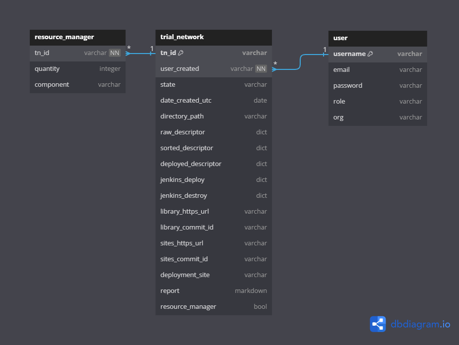

TNLCM database, created with MongoDB, consists of several collections that store important information about `resource manager`, `trial network`, `user`, and `verification token`. Below is a description of each collection, along with a graphical representation using SQL syntax created with [dbdiagram.io](https://dbdiagram.io/).

## Collections

### Collection `resource_manager`

| Field       | Type    | Description                                       |
| ----------- | ------- | ------------------------------------------------- |
| `component` | string  | Component over which resources are controlled     |
| `tn_id`     | string  | ID of the trial network                           |
| `quantity`  | integer | Amount of component available                     |
| `ttl`       | float   | Time the component can be used in a trial network |

### Collection `trial_network`

| Field                               | Type     | Description                                |
| ----------------------------------- | -------- | ------------------------------------------ |
| `user_created`                      | string   | User that created the trial network        |
| `tn_id`                             | string   | ID of the trial network (primary key)      |
| `state`                             | string   | State of the trial network                 |
| `date_created_utc`                  | date     | Creation date and time in UTC              |
| `raw_descriptor`                    | dict     | Raw descriptor of the trial network        |
| `sorted_descriptor`                 | dict     | Sorted descriptor                          |
| `deployed_descriptor`               | dict     | Current status of descriptor               |
| `report`                            | markdown | Report related to the trial network        |
| `directory_path`                    | string   | Directory where trial network is saved     |
| `jenkins_deploy_pipeline`           | string   | Pipeline for descriptor deployment         |
| `jenkins_destroy_pipeline`          | string   | Pipeline for destroying trial network      |
| `deployment_site`                   | string   | Deployment site of trial network           |
| `input`                             | dict     | YAML files per entity-name sent to Jenkins |
| `output`                            | dict     | JSON received by Jenkins per entity-name   |
| `library_https_url`                 | string   | Library github https url                   |
| `library_commit_id`                 | string   | Library commit ID                          |
| `sites_https_url`                   | string   | Sites github https url                     |
| `sites_commit_id`                   | string   | Sites commit ID                            |

### Collection `user`

| Field      | Type   | Description                   |
| ---------- | ------ | ----------------------------- |
| `email`    | string | User's email address          |
| `username` | string | User's username (primary key) |
| `password` | string | User's hashed password        |
| `role`     | string | User's role                   |
| `org`      | string | User's organization           |

### Collection `verification_token`

| Field                | Type   | Description                             |
| -------------------- | ------ | --------------------------------------- |
| `new_account_email`  | string | Email for the new account (primary key) |
| `verification_token` | string | Verification token for the account      |
| `creation_date`      | date   | Creation date of the verification token |

## Relationships

- `resource_manager.tn_id > trial_network.tn_id` // resource_manager references trial_network
- `trial_network.user_created > user.username` // A user can have multiple trial_networks (one-to-many)
- `verification_token.new_account_email - user.email` // One-to-one relationship between verification_token and user

## Model

