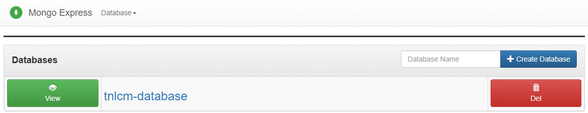

import Link from "@docusaurus/Link";
import { TNLCM_BACKEND_DOTENV_TEMPLATE } from "@site/src/constants/v0.4.1";

A MongoDB dashboard will be available at the url http://mongo-express-ip:8081 where the database can be managed.

:::note
User and password to access to the MongoDB dashboard are the values indicated in the variables `ME_CONFIG_BASICAUTH_USERNAME` and `ME_CONFIG_BASICAUTH_PASSWORD` of the `.env` file. By default, the values indicated in the <Link to={TNLCM_BACKEND_DOTENV_TEMPLATE}>`.env.template`</Link> file are used.
:::

