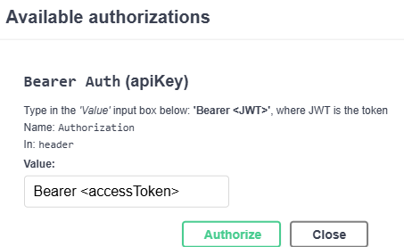
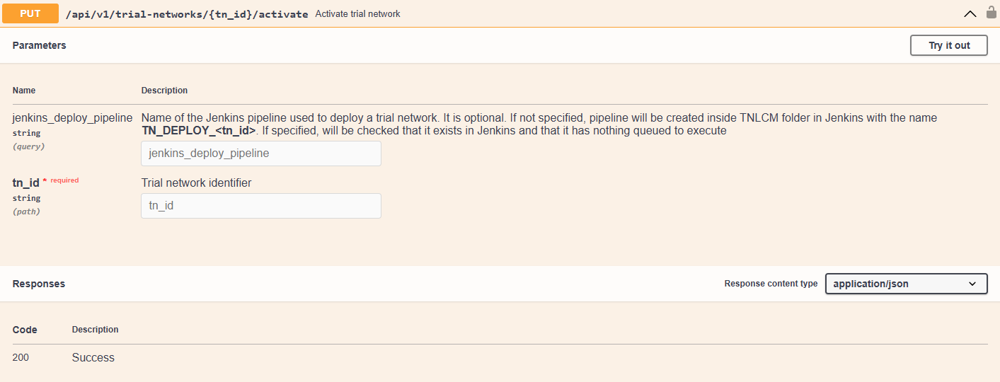

## Login

The API set forth in the TNLCM is as follows:

If it is the first time using the API it is necessary to create a user:

Once the user has been created or if it has been previously created, add the user and its password in the Basic Authorization section of the **Authorize** box:

Once the user has been added, an access token and its refresh token can be generated. This access token has a duration of one day (can be modified):

The next step is to add the token in the green **Authorize** box. It is required to put the word **Bearer**, a space and then the token. An example is shown:

Now, requests that involve having an access token can be made.

If the access token expires, it can be refreshed by using the refresh token. The token in the green **Authorize** box must be updated with the refresh token and the post request must be made:

When the request is made, it will return another access token that will need to be put back into the green **Authorize** box.

## Create trial network

Once logged into TNLCM, execute the POST request of the `trial-network` namespace:

Fill in the following fields:

- `tn_id`: must start with a character and be at least 4 characters long. This field can be left blank, in which case a random value will be generated.
- `library_reference_type`: you can specify a branch, tag, or commit of the 6G-Library repository.
- `library_reference_value`: value corresponding to the type specified in the `library_reference_type` field.
- `deployment_site`: must be one of the branches available in the [6G-Sandbox-Sites](https://github.com/6G-SANDBOX/6G-Sandbox-Sites) repository.
- `descriptor`: descriptor file containing the definition of the trial network. To create a descriptor file, refer to the [Trial Network Descriptor Schema](./descriptor-schema.md) section.

## Deploy trial network

Once logged into TNLCM and the trial network has been created, execute the PUT request of the `trial-network` namespace:

Fill in the following fields:

- `jenkins_deploy_pipeline`: if nothing is specified, a pipeline will be created inside the TNLCM folder in Jenkins with the name `TN_DEPLOY_<tn_id>`. If specified, it will be checked if it exists in Jenkins and that there is nothing queued to execute.
- `tn_id`: the identifier of the trial network received in the [POST request](#create-trial-network).

## Destroy trial network

Once logged into TNLCM, the trial network has been created and the trial network has been deployed, execute the DELETE request to destroy a trial network:

Fill in the following fields:

- `jenkins_destroy_pipeline`: if nothing is specified, a pipeline will be created inside TNLCM folder in Jenkins with the name `TN_DESTROY_<tn_id>`. If specified, it will be checked if it exists in Jenkins and that there is nothing queued to execute.
- `tn_id`: the identifier of the trial network received in the [POST request](#create-trial-network).

## Purge trial network

Once logged into TNLCM, the trial network has been created, deployed and destroyed, execute the DELETE request to purge a trial network:

Fill in the following fields:

- `tn_id`: the identifier of the trial network received in the [POST request](#create-trial-network).

## Use Hoppscotch

Hoppscotch is a free API request builder that allows you to make requests to the TNLCM API. To use it:

- Go to the official website [Hoppscotch](https://hoppscotch.io/)
- Install the [extension](https://chromewebstore.google.com/detail/hoppscotch-browser-extens/amknoiejhlmhancpahfcfcfhllgkpbld) in your browser and enable it
- Once installed, access the TNLCM API URL and open the extension. Add a new origin, which is the TNLCM API URL, as shown in the image:

    

- In the [Hoppscotch settings](https://hoppscotch.io/settings), select extensions in the interceptor section
- Next, import the JSON file located in the [hoppscotch](https://github.com/6G-SANDBOX/TNLCM/tree/main/hoppscotch) directory of the TNLCM repository
- Finally, proceed to make requests following the order of the HTTP methods
