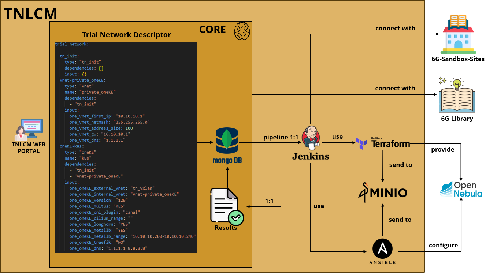
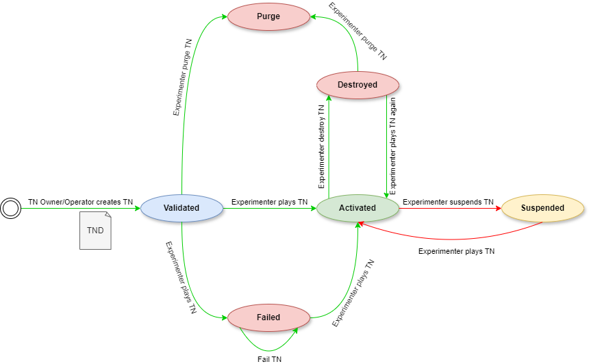

## Overview of TNLCM and 6G-Library implementation

## State Machine

TNLCM is a **state machine** that allows the automation of component deployment. Green indicates what is implemented and red indicates what is in the process of implementation.

### States

- **Validated**: trial network descriptor created is checked to see if it can be deployed. 6G-Library is used to validate it
- **Activated**: trial network has been deployed in OpenNebula
- **Suspended**: trial network has been suspended. It remains deployed, but turned off
- **Failed**: there was an error during the trial network deployment
- **Destroyed**: trial network deployment in OpenNebula is removed, but its content is kept in the database and locally
- **Purge**: the trial network and the callbacks are removed from the database as well as its local content

### Transitions

- Initial state &rarr; Validated: trial network descriptor validated and ready for deploy
- Validated &rarr; Activated: trial network deployed and ready for use
- Validated &rarr; Failed: trial network deployment failed
- Validated &rarr; Purge: trial network invalid
- Failed &rarr; Failed: again, trial network deployment failed
- Activated &rarr; Destroyed: trial network destroyed and ready for deploy again
- Activated &rarr; Suspended: TODO
- Suspended &rarr; Activated: TODO
- Destroyed &rarr; Activated: trial network deployed and ready for use 
- Destroyed &rarr; Purge: trial network removed

