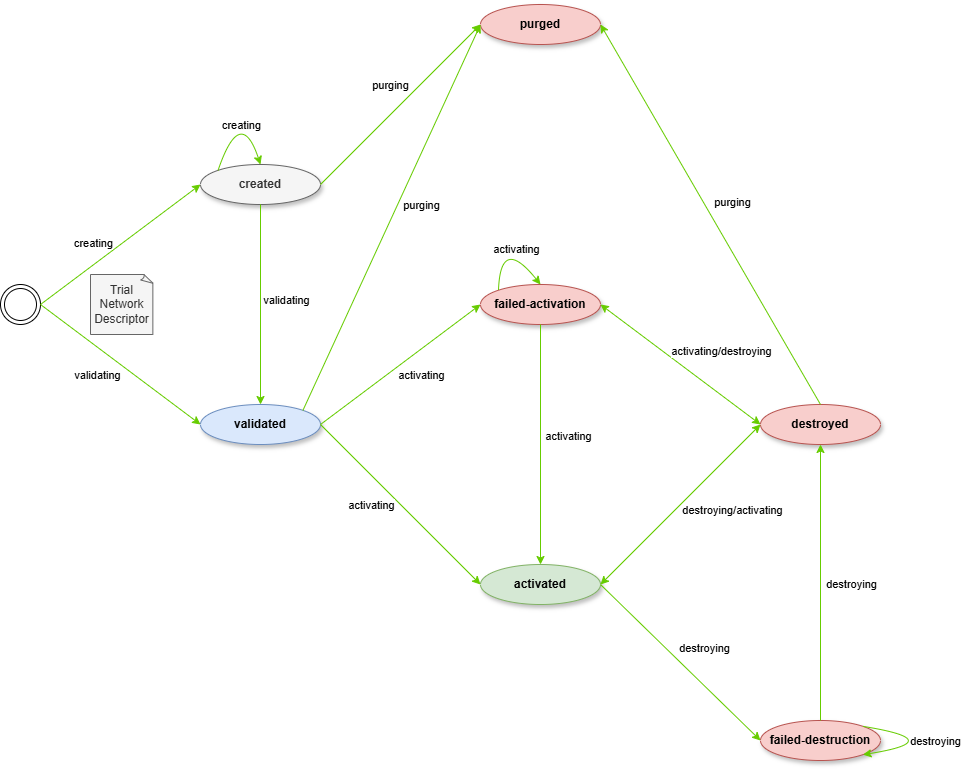

## Overview of TNLCM and 6G-Library implementation

## State Machine

TNLCM is a **state machine** that allows the automation of component deployment. Green indicates what is implemented and red indicates what is in the process of implementation.

### States

- **activated**: the trial network is deployed in OpenNebula and ready to use.
- **created**: the trial network descriptor is created but not yet validated.
- **destroyed**: the trial network deployment is removed from OpenNebula and ready for deploy again.
- **suspended**: the trial network is not in use but it is still deployed in OpenNebula.
- **validated**: the trial network descriptor is created and validated. It is ready to be deployed in OpenNebula.
- **pending-activation**: the trial network deployment failed. It is waiting for the user to try again.
- **pending-destruction**: the trial network deployment removal failed. It is waiting for the user to try again.
- **purged**: all the information about the trial network is removed from the database.

### Transitions

- **initial-state** &rarr; **created**: create a trial network descriptor that not yet validated. It allows save the descriptor for further editing at a later time.
- **initial-state** &rarr; **validated**: create and validate a trial network descriptor in the same step. It check if the descriptor can be deployed.
- **created** &rarr; **validated**: apply validation to the trial network descriptor.
- **created** &rarr; **purged**: remove all the information about the trial network in database.
- **validated** &rarr; **purged**: remove all the information about the trial network in database.
- **validated** &rarr; **activated**: activate the trial network. It deploys the trial network in OpenNebula.
- **validated** &rarr; **pending-activation**: trial network deployment failed. It is waiting for the user to try again.
- **pending-activation** &rarr; **pending-activation**: retry the trial network deployment and it fails again.
- **pending-activation** &rarr; **activated**: retry the trial network deployment and it is successful.
- **pending-activation** &rarr; **destroyed**: remove the trial network deployment from OpenNebula and ready for deploy again.
- **activated** &rarr; **suspended**: TODO.
- **activated** &rarr; **destroyed**: remove the trial network deployment from OpenNebula and ready for deploy again.
- **suspended** &rarr; **activated**: TODO.
- **destroyed** &rarr; **purged**: remove all the information about the trial network in database.
- **destroyed** &rarr; **pending-destruction**: trial network deployment removal failed. It is waiting for the user to try again.
- **destroyed** &rarr; **pending-activation**: retry the trial network deployment and it fails.
- **destroyed** &rarr; **activated**: retry the trial network deployment and it is successful.

