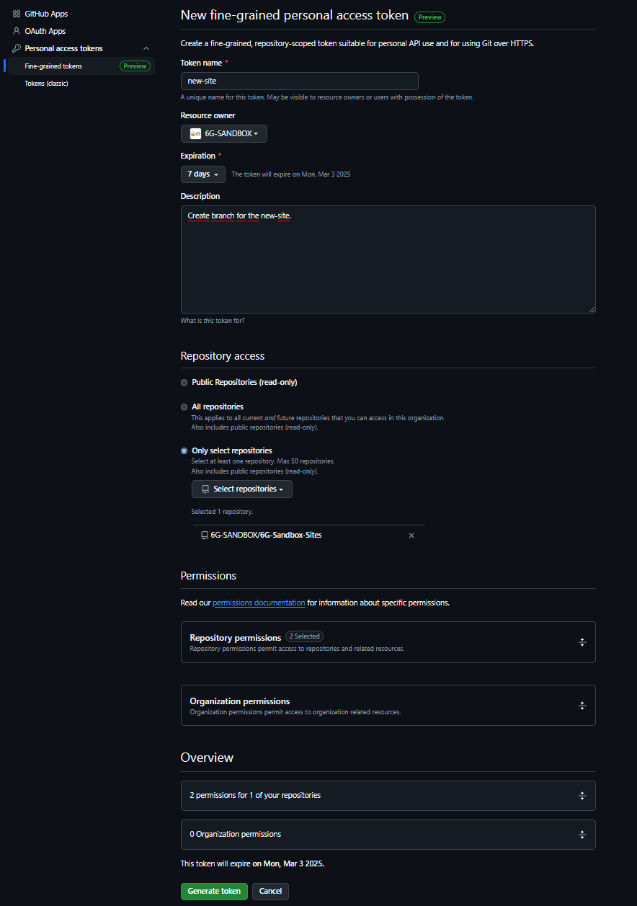
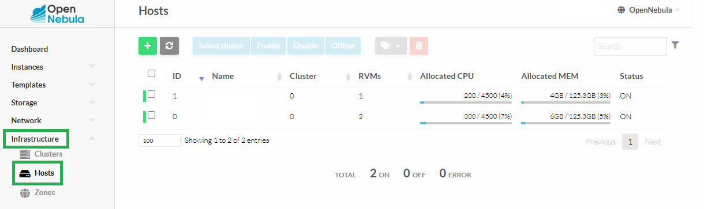
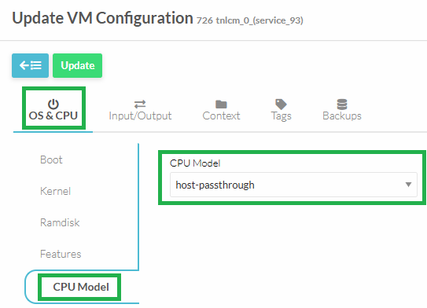

import CodeBlock from '@theme/CodeBlock';
import Link from '@docusaurus/Link';
import { ONE_REPO_RELEASE, ONE_REPO_VERSION, SANDBOX_SITES_ACCESS_REQUEST_ISSUE, SANDBOX_ORGANIZATION, SANDBOX_SITES_TEAM, TOOLKIT_INSTALLER_INSTALL_SCRIPT } from '@site/src/constants/v0.4.1';

## Requirements

{/* TODO @alvarocurto: https://github.com/6G-SANDBOX/6G-Sandbox-Sites/blob/main/.dummy_site/core.yaml */}
{/* TODO @alvarocurto: have bridge interface configurated */}
{/* TODO @alvarocurto: have a public ip configurated */}
{/* TODO @alvarocurto: have a port forwarding configurated */}

Toolkit installer requires the **prior** installation of:

- **OpenNebula**: <Link to={ONE_REPO_RELEASE}>{ONE_REPO_VERSION}</Link>

Once you have **properly** installed OpenNebula, you can proceed with the following steps.

## Create site token

If you don't have a token to access the 6G-Sandbox-Sites repository, you need to request access:

1. Create an <Link to={SANDBOX_SITES_ACCESS_REQUEST_ISSUE}>**issue**</Link> in the repository 6G-Sandbox-Sites requesting to join to the <Link to={SANDBOX_ORGANIZATION}>**6G-SANDBOX organization**</Link>.
2. Assign the issue to **@CarlosAndreo** or **@alvarocurt**. Additionally, add the `request-access` label.
3. The administrators will review the request and add you to the organization if approved.
4. Once you have access to 6G-SANDBOX organization, the administrators will add you to the <Link to={SANDBOX_SITES_TEAM}>6G-SANDBOX sites contributors</Link> group.

Then you can generate a token by navigating to:

1. **Settings**
2. **Developer settings**
3. **Personal access tokens**
4. **Fine-grained tokens**
5. **Generate new token**

The configuration should look like this:



The repository required permission to enable is:

- **Contents**: read and write

## Access to OpenNebula frontend

Access via SSH to OpenNebula frontend with root user.

## Download installation script

Download the installation script using one of the following command.

- Using `curl`:

<CodeBlock language="bash">
    {`curl -O ${TOOLKIT_INSTALLER_INSTALL_SCRIPT}`}
</CodeBlock>

- Using `wget`:

<CodeBlock language="bash">
    {`wget ${TOOLKIT_INSTALLER_INSTALL_SCRIPT}`}
</CodeBlock>

## Execute installation script

Give execution permissions to the script:

```bash
chmod +x install.sh
```

Run the script and follow the instructions:

```bash
./install.sh
```

## Known issues

TNLCM uses MongoDB as a database to store trial networks. MongoDB is not compatible with all CPUs. By default, TNLCM is installed on a virtual machine hosted on an OpenNebula host with the CPU model set to `host-passthrough`. This model type is not recommended unless **there is no OpenNebula host available** that meets the following requirements:

- **x86_64 (amd64) architecture**: MongoDB only supports 64-bit systems.
- **SSE4.2 and AVX instruction sets**: recent versions of MongoDB require these instructions to function properly.

Therefore, it is recommended to move the TNLCM virtual machine to an OpenNebula host that is compatible with MongoDB.

To check the CPU models of the hosts, you can access the Infrastructure tab from the left sidebar of OpenNebula's Sunstone, go to Host and select the host. Once a host is selected, in the Info section, scroll down to the Attributes section, where the **KVM_CPU_MODEL** field shows the host's CPU model.



Some of the CPU models compatible with MongoDB based on our tests are:

- Cascadelake-Server-noTSX
- Broadwell-IBRS
- Broadwell-noTSX

To move the TNLCM virtual machine to a MongoDB-compatible host with the correct CPU model, follow these steps:

1. Access OpenNebula's Sunstone.
2. Perform an Undeploy of the TNLCM virtual machine.
3. Go to the Conf section of the virtual machine.
4. Select Update Configuration.
5. In the OS & CPU section, under CPU Model, select the CPU model of the new host where the TNLCM virtual machine will be moved.

<p align="center">
    
</p>

6. Finally, Deploy the TNLCM virtual machine on the new host. When deploying, you will have the option to select the host. Choose the same host where you updated the CPU model.

:::note
In general, these steps will be necessary in all cases where a virtual machine is deployed in OpenNebula that has MongoDB.
:::

{/* TODO @CarlosAndreo: add video/demo how to deploy service toolkit using toolkit-installer repository */}
