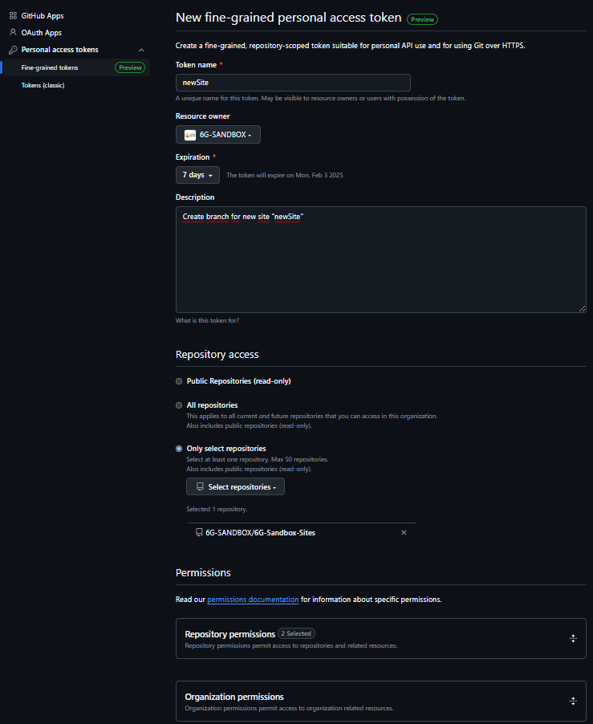

## :white_check_mark: Requirements

Toolkit installer requires the **prior** installation of:

- **OpenNebula**: [v6.10](https://github.com/OpenNebula/one/releases/tag/release-6.10.0)

Once you have OpenNebula installed, you can proceed with the following steps.

## Create site token

Create an [**issue**](https://github.com/6G-SANDBOX/6G-Sandbox-Sites/issues/new?q=is%3Aissue&template=access_request.md) in the repository 6G-Sandbox-Sites requesting to join to the [**6G-SANDBOX sites contributors**](https://github.com/orgs/6G-SANDBOX/teams/6gsandbox-sites-contributors) group.

Assign the issue to **@CarlosAndreo** or **@alvarocurt**. Additionally, add the `access-request` label.

The administrators will review the request and add you to the group if approved.

Once you have the necessary permissions, you can generate a token by navigating to:

1. **Settings**
2. **Developer settings**
3. **Personal access tokens**
4. **Fine-grained tokens**
5. **Generate new token**

The configuration should look like this:



The required permission to enable is:

- **Contents**: read and write

## :inbox_tray: Download the installation script

Download the installation script which is [`installer.sh`](https://github.com/6G-SANDBOX/toolkit-installer/blob/main/scripts/installer.sh).

## :desktop_computer: Execute installation script

:::important
The script execution must be performed in the OpenNebula frontend using **root** user.
:::

Give execution permissions to the script:

```bash
chmod +x installer.sh
```

Run the script and follow the instructions:

```bash
./installer.sh
```

<!-- TODO: add video/demo how to deploy service toolkit using toolkit-installer repository -->