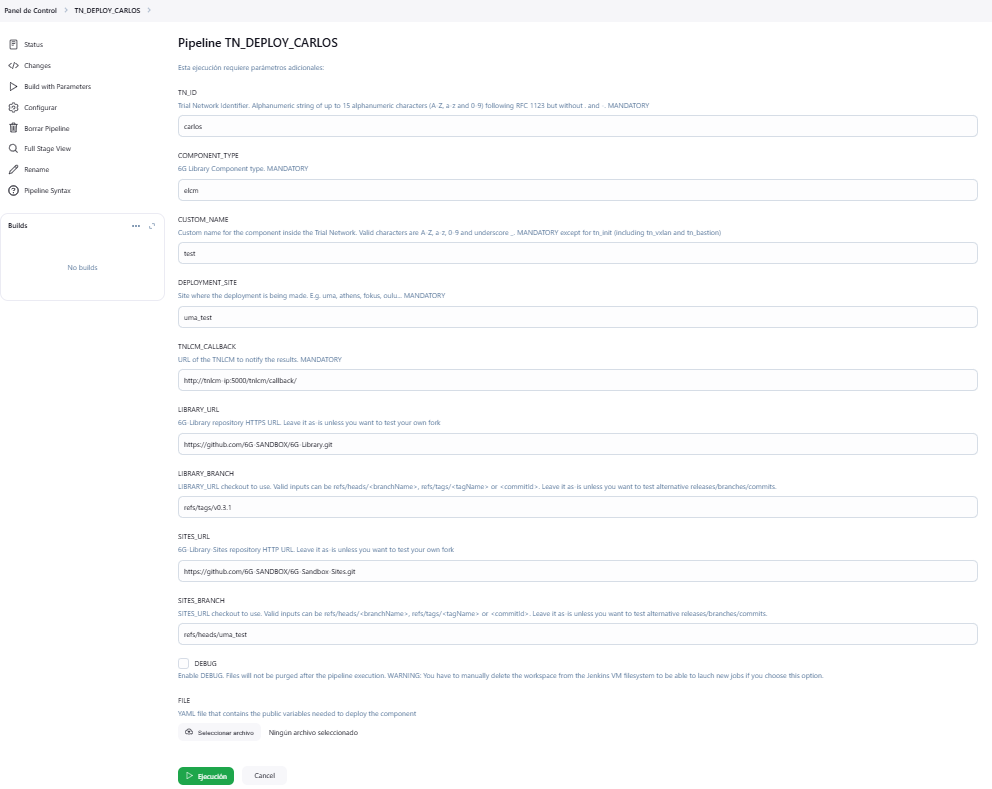

Jenkins is an open-source automation server used to build, test and deploy software projects, enabling continuous integration and delivery (CI/CD). It supports a wide range of plugins to integrate with various tools and streamline development workflows.

## How to login

The Jenkins server is enabled on port 8080 of the machine on which it is deployed.

To access it, the credentials provided at the time of deploying the toolkit are used.

Once you access to the Jenkins dashboard you will see two main pipelines which are `TN_DEPLOY` and `TN_DESTROY`. There may be more pipelines, but the main ones are these two.

## How to clone pipeline

Create your own pipeline to test your components. It is achieved by cloning the `TN_DEPLOY` pipeline. The steps to follow are:

1. Select new task.
2. Enter an item name. The name of the pipeline must be a clear name. It is recommended to put `TN_DEPLOY_<personName>`.
3. Fill in the `Copy from` field with the name `TN_DEPLOY`.
4. Select ok.
5. In the configuration section do **not touch anything** and select save.

## How to deploy component

Once the pipeline has been cloned, you can proceed to deploy components by following these steps:

1. Access the pipeline and on the left sidebar go to the `Build with Parameters` section.
2. Fill in the fields as described in the table below:

| Field               | Description |
|---------------------|-------------|
| **TN_ID**           | The identifier of the trial network. If your component requires the deployment of different components previously, you must indicate the same tn_id in each deployment. For example: if you want to deploy the ELCM component. The ELCM component of the 6G-Library requires to have previously deployed the tn_init component. Let's imagine that the trial network identifier is test. First you need to deploy the tn_init component with tn_id test and then the ELCM component with tn_id test. |
| **COMPONENT_TYPE**  | The type of component being deployed. This component must be developed in the [6G-Library](https://github.com/6G-SANDBOX/6G-Library). |
| **CUSTOM_NAME**     | Custom name for the component inside the trial network. |
| **DEPLOYMENT_SITE** | The site where the component is to be deployed. It must be a directory inside the branch in the [6G-Sandbox-Sites](https://github.com/6G-SANDBOX/6G-Sandbox-Sites) repository. |
| **TNLCM_CALLBACK**  | You can leave the default value. |
| **LIBRARY_URL**     | 6G-Library repository HTTPS URL. |
| **LIBRARY_BRANCH**  | You can specify a branch, commit or tag of the 6G-Library in which your component is developed. Valid inputs: `refs/heads/<branchName>`, `refs/tags/<tagName>` or `<commitId>`. |
| **SITES_URL**       | 6G-Sandbox-Sites repository HTTP URL. |
| **SITES_BRANCH**    | You can specify a branch, commit or tag of 6G-Sandbox-Sites with your platform. Valid inputs: `refs/heads/<branchName>`, `refs/tags/<tagName>` or `<commitId>`. |
| **DEBUG**           | Flag for debugging your component. |
| **FILE**            | YAML file in which you must specify the mandatory fields from the input section of the [public.yaml](https://github.com/6G-SANDBOX/6G-Library/blob/main/.dummy_component/.tnlcm/public.yaml) file of the component in the 6G-Library. |

## Example

In this example we are going to show how to deploy the [ELCM](https://github.com/6G-SANDBOX/6G-Library/tree/main/elcm) component of the 6G-Library.

As mentioned above, the first thing needed for elcm is to deploy the tn_init component.

In this case, the tn_init [input](https://github.com/6G-SANDBOX/6G-Library/blob/main/tn_init/.tnlcm/public.yaml) fields are not required since the required_when is set to false in all fields. This indicates that it takes the values specified by default in the file [private.yaml](https://github.com/6G-SANDBOX/6G-Library/blob/main/tn_init/variables/one/private.yaml). However, you can modify the values by creating a yaml file locally and attaching it to the pipeline. Let's set these values:

```yaml
one_vxlan_netmask: 24
one_vxlan_first_ip: "192.168.214.1"
one_vxlan_address_size: 254
one_bastion_vpn_clients: 3
one_bastion_vpn_allowedips: "0.0.0.0/0"
```

The name of the file can be `tn_init.yaml`.

The pipeline should look as follows:


Once the deployment time has elapsed, the elcm component is deployed:

In this case, the elcm [input](https://github.com/6G-SANDBOX/6G-Library/blob/main/elcm/.tnlcm/public.yaml) fields are not required since the required_when is set to false in all fields. This indicates that it takes the values specified by default in the file [private.yaml](https://github.com/6G-SANDBOX/6G-Library/blob/main/elcm/variables/one/private.yaml). However, you can modify the values by creating a yaml file locally and attaching it to the pipeline. Let's set these values:

```yaml
one_elcm_influxdb_user: "elcm"
one_elcm_influxdb_password: "elcm"
one_elcm_influxdb_database: "db"
one_elcm_grafana_password: "elcm"
```

The name of the file can be `elcm.yaml`.

The pipeline should look as follows:


