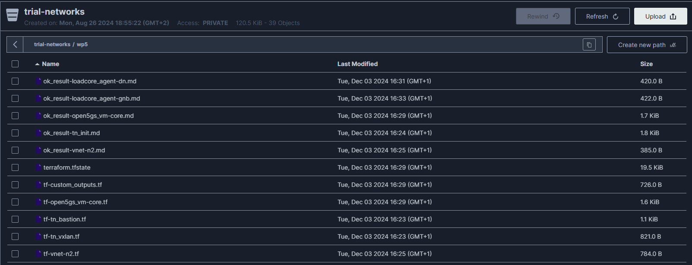

MinIO is a high-performance, open-source object storage system compatible with Amazon S3, designed for large-scale data infrastructure and supporting hybrid and cloud-native environments.

## How to login

The MinIO server is enabled on port 9001 of the machine on which it is deployed.

To access it, the credentials provided at the time of deploying the toolkit are used.

Once you access the MinIO dashboard, you will see a bucket called trial-networks. It will store the information for each trial network generated during its deployment. For each trial network, a folder is created with its identifier. In that folder, a markdown file is stored for each component deployed in the trial network. Additionally, it contains the Terraform file for each component and a global Terraform file for the entire deployment.

An example can be seen in the following screenshot:

